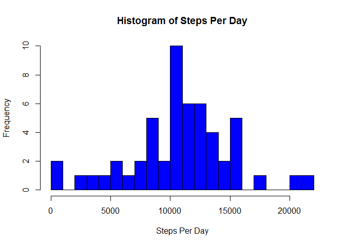
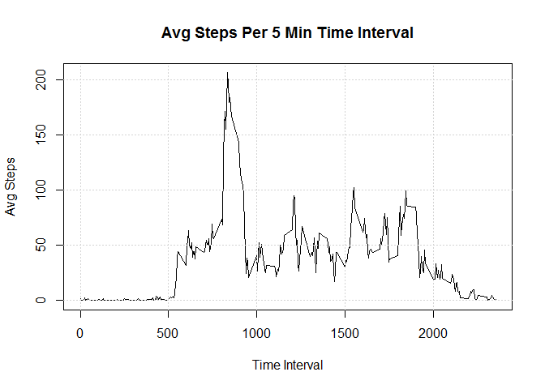
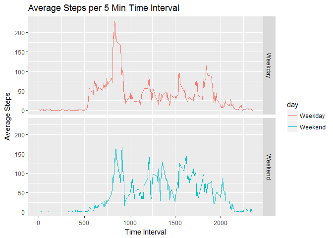

# Reproducible Research: Peer Assessment 1


## Loading and preprocessing the data
Preprocessing will include setting the working directory, unzipping the file, loading the required libraries (I like using SQL) and reading the file into a dataset called $activity

```r
setwd("d:/git/RepData_PeerAssessment1")
unzip("activity.zip")
require(sqldf)
```

```
## Loading required package: sqldf
```

```
## Loading required package: gsubfn
```

```
## Loading required package: proto
```

```
## Loading required package: RSQLite
```

```r
require(lubridate)
```

```
## Loading required package: lubridate
```

```
## 
## Attaching package: 'lubridate'
```

```
## The following object is masked from 'package:base':
## 
##     date
```

```r
require(dplyr)
```

```
## Loading required package: dplyr
```

```
## 
## Attaching package: 'dplyr'
```

```
## The following objects are masked from 'package:lubridate':
## 
##     intersect, setdiff, union
```

```
## The following objects are masked from 'package:stats':
## 
##     filter, lag
```

```
## The following objects are masked from 'package:base':
## 
##     intersect, setdiff, setequal, union
```

```r
activity<-read.csv(file="activity.csv",header=TRUE, sep=",")
activity$date <- ymd(activity$date)
```

## What is mean total number of steps taken per day?
For this part of the assignment, you can ignore the missing values in the dataset.

1) Calculate the total number of steps taken per day

```r
stepsByDay <-sqldf("select date, sum(steps) sumSteps  from activity where steps is NOT NULL group by date")
stepsByDay<-transform(stepsByDay, sumSteps=as.numeric(sumSteps))
head(stepsByDay)
```

```
##         date sumSteps
## 1 2012-10-02      126
## 2 2012-10-03    11352
## 3 2012-10-04    12116
## 4 2012-10-05    13294
## 5 2012-10-06    15420
## 6 2012-10-07    11015
```

2) If you do not understand the difference between a histogram and a barplot, research the difference between them. Make a histogram of the total number of steps taken each day

```r
hist(stepsByDay$sumSteps, main="Histogram of Steps Per Day", xlab="Steps Per Day", col="blue", breaks=25)
```

<!-- -->


3) Calculate and report the mean and median of the total number of steps taken per day

```r
mean(stepsByDay$sumSteps, na.rm = TRUE)
```

```
## [1] 10766.19
```

```r
median(stepsByDay$sumSteps, na.rm = TRUE)
```

```
## [1] 10765
```


## What is the average daily activity pattern?
1) Make a time series plot (i.e. type = "l") of the 5-minute interval (x-axis) and the average number of steps taken, averaged across all days (y-axis)

```r
timeSeries <-sqldf("select interval,avg(steps) as avgSteps from activity where steps is not NULL group by interval")
plot(timeSeries$interval, timeSeries$avgSteps,type="l", main="Avg Steps Per 5 Min Time Interval", xlab="Time Interval", ylab="Avg Steps")
grid(NULL,NULL,col="lightgrey",lty="dotted")
```

<!-- -->

2) Which 5-minute interval, on average across all the days in the dataset, contains the maximum number of steps?

```r
max(timeSeries$avgSteps, rm.na=TRUE)
```

```
## [1] 206.1698
```
## Imputing missing values
1) Calculate and report the total number of missing values in the dataset (i.e. the total number of rows with NAs).

```r
sqldf("select count(*) from activity where steps IS NULL")
```

```
##   count(*)
## 1     2304
```
2) Devise a strategy for filling in all of the missing values in the dataset. The strategy does not need to be sophisticated. For example, you could use the mean/median for that day, or the mean for that 5-minute interval, etc.  Our strategy will be to 

* use the timeSeries dataset with the average for the 5 minute interval, excluding nulls 

* join that dataset to activity and replace the missing intervals with the average 

* create another dataset of activityWoNA 


```r
head(timeSeries)
```

```
##   interval  avgSteps
## 1        0 1.7169811
## 2        5 0.3396226
## 3       10 0.1320755
## 4       15 0.1509434
## 5       20 0.0754717
## 6       25 2.0943396
```

```r
activityWoNA<-sqldf("select a.steps as realSteps, CASE WHEN a.steps is NULL THEN CAST(ts.avgSteps as Integer) ELSE a.steps END as steps, a.date, a.interval from activity a inner join timeSeries ts ON a.interval = ts.interval")
sqldf("select * from activityWoNA where realSteps IS NULL LIMIT 6")
```

```
##   realSteps steps       date interval
## 1        NA     1 2012-10-01        0
## 2        NA     0 2012-10-01        5
## 3        NA     0 2012-10-01       10
## 4        NA     0 2012-10-01       15
## 5        NA     0 2012-10-01       20
## 6        NA     2 2012-10-01       25
```


3) Create a new dataset "activityWoNA" that is equal to the original dataset but with the missing data filled in.
Make a histogram of the total number of steps taken each day 

```r
head(activityWoNA)
```

```
##   realSteps steps       date interval
## 1        NA     1 2012-10-01        0
## 2        NA     0 2012-10-01        5
## 3        NA     0 2012-10-01       10
## 4        NA     0 2012-10-01       15
## 5        NA     0 2012-10-01       20
## 6        NA     2 2012-10-01       25
```

```r
stepsByDayImp <-sqldf("select date, sum(steps) sumSteps  from activityWoNA group by date")
stepsByDayImp<-transform(stepsByDayImp, sumSteps=as.numeric(sumSteps))
head(stepsByDayImp)
```

```
##         date sumSteps
## 1 2012-10-01    10641
## 2 2012-10-02      126
## 3 2012-10-03    11352
## 4 2012-10-04    12116
## 5 2012-10-05    13294
## 6 2012-10-06    15420
```

and calculate and report the mean and median total number of steps taken per day. 
Do these values differ from the estimates from the first part of the assignment? 

*Yes the values differ, see the comparisons below*

###Mean/Median Comparison: 
**Original with NA's**

```r
mean(stepsByDay$sumSteps)
```

```
## [1] 10766.19
```

```r
median(stepsByDay$sumSteps)
```

```
## [1] 10765
```
**vs NA's Imputed**

```r
mean(stepsByDayImp$sumSteps)
```

```
## [1] 10749.77
```

```r
median(stepsByDayImp$sumSteps)
```

```
## [1] 10641
```


* What is the impact of imputing missing data on the estimates of the total daily number of steps? 

*The impact of imputing the data appears to reduce the mean and median*

## Are there differences in activity patterns between weekdays and weekends?

```r
activityWoNA$wd <-weekdays(activityWoNA$date, abbreviate = TRUE)
activityWoNA<-sqldf("select *, case when wd in ('Sat', 'Sun') then 1 else 0 end as isWeekend from activityWoNA")
weekendInterval<-sqldf("select interval, avg(steps) as avgSteps from activityWoNA where isWeekend=1 group by interval")
weekdayInterval<-sqldf("select interval, avg(steps) as avgSteps from activityWoNA where isWeekend = 0 group by interval")

plot(weekendInterval$interval, weekendInterval$avgSteps,type="l", main="Avg Steps Per 5 Min Time Interval", xlab="Time Interval", ylab="Avg Steps",col="red", ylim=c(0,350))
  lines(weekdayInterval$interval, weekdayInterval$avgSteps,type="l", col="blue", lty=2)
  grid(NULL,NULL,col="lightgrey",lty="dotted")
  legend(0,350, legend=c("Weekend", "Weekday"), col=c("red", "blue"), lty=1:2 )
```

<!-- -->


*Weekend vs Weekday walking patterns seem to indicate that weekend walking is more steady during the intervals while there are definte peaks of walking during weekedays*


